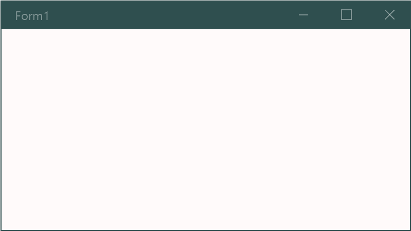
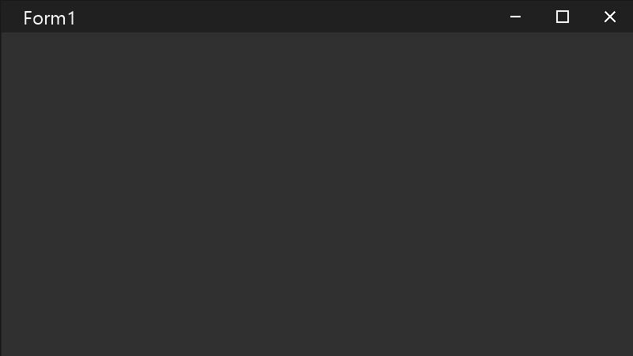
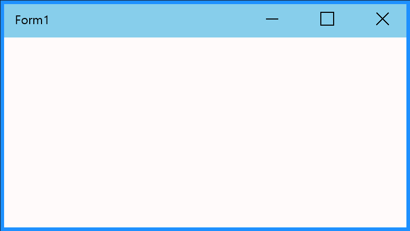

# **CustomForm for Windows Forms**

## About
CustomForm is example of full customized window using Windows Forms.

CustomForm is inspired by IgnaceMaes's [MaterialSkin](https://github.com/IgnaceMaes/MaterialSkin).

## Requirements
- Visual Studio 2019 Community
- .NET 5.0

## Features
These properties can be changed.
- Title Bar Color
- Title Bar Height
- Border Color
- Border Width
- Background Color

## Screenshots

## Unsupported
Show Icon on Title Bar.

